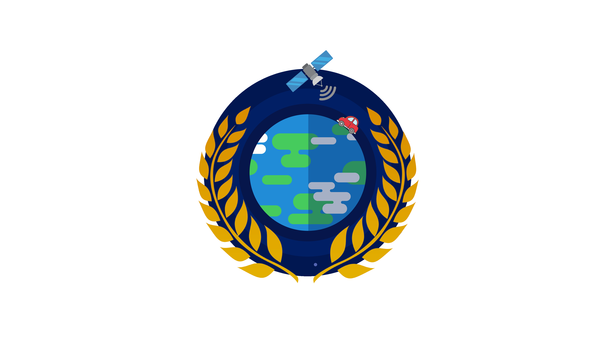

<!-- PROJECT LOGO -->
 

  

<h3 align="center">Wheat Watchers</h3>

  

    Innovating methods for agricultural ground data collection and crop assessments using street level images and satellite data:  
    A prototype in Alsace
 
  

<!-- TABLE OF CONTENTS -->

  
Table of Contents

  <ol>
    <li>
      <a href="#about-the-project">About The Project</a>
      <ul>
        <li><a href="#input-and-output-of-the-project">Input and output of the project</a></li>
        <li><a href="#software-requirements">Software requirements</a></li>
        <li><a href="#some-python-libraries-you-will-need-to-include-and-to-install-if-it-is-not-already-done">Some Python libraries you will need to include (and to install if it is not already done)</a></li>
      </ul>
    </li>
    <li>
      <a href="#getting-started">Getting Started</a>
      <ul>
        <li><a href="#creation-of-the-working-directory">Creation of the working directory</a></li>
        <li><a href="#brief-description-of-the-main-files-and-directories">Brief description of the main files and directories</a></li>
      </ul>
    </li>
    <li><a href="#usage">Usage</a></li>
     <ul>
       <li><a href="#step-1-drop-videos-and-run-videostoframespy">Step 1: Drop videos and run <i>videosToFrames.py</i></a></li>
        <li><a href="#step-2-enter-the-parameters-of-your-cameras-and-machine-learning-model-and-run-mainpy">Step 2: Enter the parameters of your cameras and machine learning model and run <i>main.py</i></a></li>
        <li><a href="#step-3-open-google-my-maps-and-create-the-map">Step 3: Open Google My Maps and create the map</a></li>
      </ul>
    </li>
  </ol>

<!-- ABOUT THE PROJECT -->
## About The Project

  
The project is part of a project to monitor crops using satellite data, undertaken by Nasa's food security and agriculture program: Nasa Harvest. The objective of this program is to provide information that will allow, for example, to anticipate crop failures and therefore agricultural production deficits, or to identify the most efficient practices.   

Commissioned by members of the TRIO research team of the ICube laboratory, our project concerns more specifically the field collection of data (crop images collected by a camera) that should allow the interpretation of satellite images (by training machine learning models).  

The first challenge is to develop a method to evaluate the distance between the photographed object (a fragment of field/crop) and the go-pro camera mounted on a car from which the picture is taken. This step aims at assigning to the collected data an exact location (and not the road where the picture was taken). We chose to use a stereovision distance assessment method. So we needed two go-pro.

The next step consists in automating the identification of the types of crops and the agricultural practices implemented on these crops from the plantation images.  

The final objective is to obtain a detailed mapping of the crops, based on surveys conducted throughout the year. 

### Input and output of the project

You must provide two videos (or a series of videos) taken with two camera that have been placed on the roof of a car while driving near the fields. 
After running a script (videosToFrames.py), we get a series of photos from the videos.  
A last script aims to list the GPS coordinates of the car and those of the fields present on each photo with a label indicating which type of field it is in a CSV file that can by displayed on a map thanks to Google my Maps.  
 
We designed machine learning models from pictures taken in French Alsacian's fields with yolov5. One model can identify French wines while another can identify winter wheat and wether the field is tilled. 

We strongly advise you to create a custom model from your data to detect the object you need to detect. We followed the procedure described by Nicholas Renotte in his video 
[Deep Drowsiness Detection using YOLO, Pytorch and Python](https://www.youtube.com/watch?v=tFNJGim3FXw&t=912s&ab_channel=NicholasRenotte)
. Please have a look to his video, he explains how to do this from 30 min. 

### Software requirements
* [Python version 3.6+](https://www.python.org/downloads/)       
* [exiftool](https://exiftool.org/)                              
* [ffmpeg](https://www.ffmpeg.org/download.html)                 
* [yolov5](https://github.com/ultralytics/yolov5)                

### Some Python libraries you will need to include (and to install if it is not already done)

* glob
* torch
* cv2
* os
* shutil
* math
* numpy
* exif
* copy
* csv
* sys
* argparse
* pandas
* datetime
* pathlib
* subprocess
* json
* re
* traceback
* gpxpy

(<a href="#top">back to top</a>)

<!-- GETTING STARTED -->
## Getting Started
### Creation of the working directory

As the project is mainly coded in Python, it is necessary to have Python version 3.6+. After having cloned or downloaded the project, you have only a part of what is needed for its proper functioning. You need to download the exiftool and ffmpeg software and you need to put the exiftool.exe and ffmpeg.exe executables in the working directory. In fact transforming a video into a succession of photos is quite easy but we need to keep the GPS location of the cameras on each created pictures from the videos and these softwares help us not to lose them. It is also necessary to install all the Python libraries indicated in the section "Some Python libraries you will need to include".  
After this step, the organization of your working directory should look like the following tree (here WheatWatchers is the given name to our working directory):

<pre> 
WheatWatchers
│   arrayToCSV.py                                                         
│   boundingBoxesMatching.py              
│   Calc_coordonnéesGPS.py                
│   distanceCarToCrop.py                  
│   exiftool.exe                          
│   ffmpeg.exe                       
│   gf2gv.py                         
│   log.gpx                          
│   main.py                     
│   ML.py                          
│   videosToFrames.py                               
├───CSV                            
├───FRAMES                          
│   ├───LEFT                                                
│   └───RIGHT
├───RESULTATS
├───VIDEO
│   ├───LEFT
│   └───RIGHT
└───yolov5
    │   0.8.1'
    │   CONTRIBUTING.md
    │   dataset.yaml
    │   detect.py
    │   Dockerfile
    │   export.py
    │   hubconf.py
    │   LICENSE
    │   README.md
    │   requirements.txt
    │   setup.cfg
    │   train.py
    │   tutorial.ipynb
    │   val.py
    │   yolov5l.pt
    │   yolov5m.pt
    │   yolov5s.pt
    ├───.git
    │   ├───objects
    │   └───refs
    ├───.github
    │   └───workflows
    ├───data
    │   ├───hyps
    │   ├───images
    │   └───scripts
    ├───models
    │   └───hub
    ├───runs
    │   └───train
    └───utils
</pre>

### Brief description of the main files and directories

        
* <i>exiftool.exe</i> and <i>ffmpeg.exe</i> and <i>gf2gv.py</i> and <i>videosToFrames.py</i>: transform a video into a succession of photos while keeping the GPS information on each image created in the metadata 
* <i>ML.py</i>: machine learning identification and saving of the processed pictures with bounding boxes around identified objects in <b>RESULTATS</b> 
* <i>boundingBoxesMatching.py</i>: Match bounding boxes in left and right pictures to know the horizontal shift (disparity for stereovision) 
* <i>distanceCarToCrop.py</i>: calculate the distance between the car and the fields (with a correction for our GoPro Hero 5 as any GoPro has a real linear mode and it is necessary for Stereovision)   
* <i>Calc_coordonnéesGPS.py</i>: get GPS location of the car and of the fields seen on the photos  
* <i>arrayToCSV.py</i>: create a CSV file out of an array   
* <i>main.py</i>: run all the process (excepted the conversion videos->frames) and create the CSV files with the GPS locations and labels in the directory <b>CSV</b> 
* <b>VIDEO</b>: directory where you drop the videos you want to process  
* <b>FRAMES</b>: images created after the conversion video -> photos  
* <b>RESULTATS</b>: images created after the use of the machine learning model on the images from <b>FRAMES</b>  
* <b>CSV</b>: csv files created after all the processing with the GPS location of the car and the fields and fields' data 
* <b>yolov5</b>: Here is the yolov5 directory with our machine learning models and all you need to create new ones 

<!-- USAGE EXAMPLES -->
## Usage
### Step 1: Drop videos and run <i>videosToFrames.py</i>

   
First, you must drop the videos from the left camera and the right camera in the directories LEFT and RIGHT from VIDEO. 
If there are several videos, as it will be necessary for our code to be able to match the video of the right camera with the left one, it is necessary to classify them in alphabetical order. 
<i>Example:</i>

<pre> 
└───VIDEO
    ├───LEFT
    │   ├───prise11L
    │   ├───prise12L
    │   ├───prise21L
    │   ├───prise31L
    │   ├───prise41L
    │   └───prise42L
    └───RIGHT
        ├───prise11R
        ├───prise12R
        ├───prise21R
        ├───prise31R
        ├───prise41R
        └───prise42R
</pre>

  
Then you must run the script <i>videosToFrames.py</i>. You can chooose what framerate is the most suitable for your need. It is necessary to take a framerate large enough to be able to properly trace the path of the car from the GPS coordinates of the cameras. This is necessary to know the tangent in the trajectory and calculate the perpendicular to place the field at the right place. You should now have pictures in the directories RIGHT and LEFT from the directory FRAMES.

### Step 2: Enter the parameters of your cameras and machine learning model and run <i>main.py</i>

Enter the parameters of your cameras and machine learning model. As our cameras where GoPro Hero 5 and out baseline was 40cm we entered the following but please modify them to fit your setup. 

<pre> 
#Camera holder parameter
baseline=40      #distance between both cameras in centimeters
#Camera parameters
f = 35           #focal lenght
alpha = 86       #Field of view
#Machine learning parameters
confidenceMin=0.4   #minimum level of convidence to identify an object
modelPath='yolov5/runs/train/exp10/weights/last.pt'   #path to our model
</pre> 

  You can now run <i>main.py</i>. Two csv files (carData and cropData) must have been created in the directory <b>CSV</b>.

### Step 3: Open Google My Maps and create the map

* Go on Google My Maps: https://www.google.com/maps/d/u/0/     
* Add a new layer  
* Import cropData.csv  
* The website will ask you to select the columns to place the markers. You can select latitude and longitude. 
* The website will ask you to select a column to give a title to your markers. You can select crop. 
* Add again a new layer  
* Import carData.csv  
* The website will ask you to select the columns to place the markers. You can select latitude and longitude. 
* The website will ask you to select a column to give a title to your markers. You can select image. 
 
We advise you to set an individual style by grouping locations by crop to make the map easier to read.

(<a href="#top">back to top</a>)

